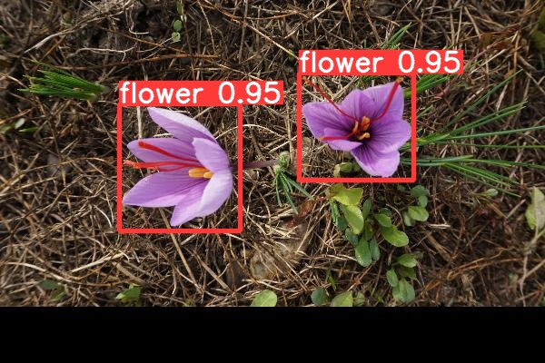

# 🔎 Saffron flower dataset 🌷 📷
Made and labelled for detection by Gaël Cartier-Michaud 
  
Completed with this dataset of purple flower photos:   
https://www.kaggle.com/datasets/mbkinaci/purple-flower-photos?resource=download

## Classes used  
- Flower  
> For one identifiable flower  
  
- Overlap
> For a group of flowers whose outlines are difficult to identify  
  
    
